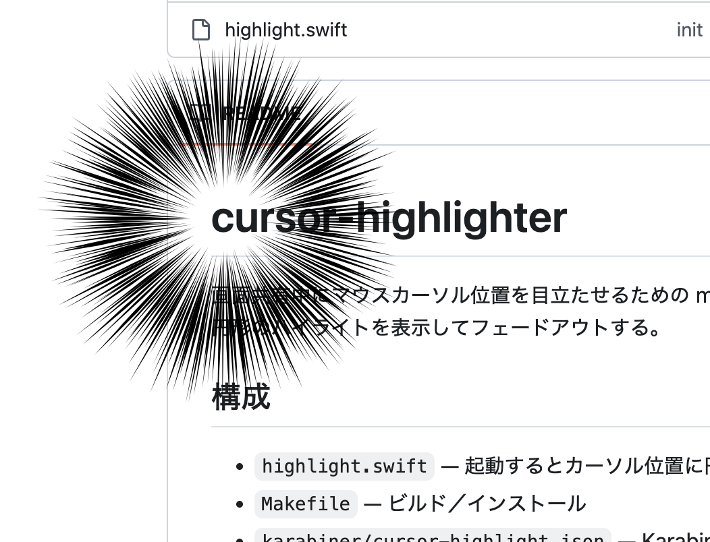

# cursor-highlighter

[](./LICENSE)

画面共有や録画でマウスカーソル位置を一瞬で目立たせるための macOS 用ユーティリティ。ホットキーで現在のカーソル位置に漫画風の **集中線アニメーション** を表示する。



## 構成

- `highlight.swift` — 起動するとカーソル位置に集中線を描画して約 2 秒で終了する単発バイナリのソース
- `Makefile` — ビルド／インストール
- `karabiner/cursor-highlight.json` — Karabiner-Elements の Complex Modifications 用設定
- `LICENSE` — MIT

## 動作要件

- macOS（Cocoa / QuartzCore が動けば動く範囲。Apple Silicon / Intel ともに想定）
- Swift コンパイラ (`swiftc`)。Xcode または Command Line Tools (`xcode-select --install`) を入れておく
- ホットキー連携を使うなら [Karabiner-Elements](https://karabiner-elements.pqrs.org/)

## ビルドとインストール

```bash
make install            # ~/.local/bin/highlight にインストール
make install-karabiner  # ~/.config/karabiner/assets/complex_modifications/ に配置
make install-all        # 両方
```

`PREFIX` でインストール先を変えられる（例: `make install-all PREFIX=/usr/local`）。`install-karabiner` は配置時にバイナリパスを `$(PREFIX)/bin/highlight` に書き換えるので、Karabiner 側の `shell_command` も追従する。

インストール後、Karabiner-Elements を開き **Settings → Complex Modifications → Add predefined rule** から *Cursor Highlight* を有効化する。

## 使い方

デフォルトの Karabiner 設定は **左 Control キー単押しで即発火**（`to_if_alone` を使わないので押した瞬間に発動、判定遅延なし）。代わりに左 Control は Control 修飾キーとしては機能しなくなるので、Ctrl+C などは **右 Control** を使う前提。

別キーに割り当てたい場合は `karabiner/cursor-highlight.json` の `from.key_code` を編集する。修飾キー機能を犠牲にしたくないなら `f13`〜`f19` などの未使用キーが扱いやすい。

シェルから直接起動も可能:

```bash
~/.local/bin/highlight
```

## カスタマイズ

`highlight.swift` 冒頭の定数を変更してリビルド (`make install`) する。

| 定数 | デフォルト | 意味 |
| --- | --- | --- |
| `canvasSize` | `280` | 集中線を描く正方形ウィンドウの一辺 (pt) |
| `lineCount` | `256` | 1 フレームあたりの線の本数 |
| `innerRadius` | `22` | 中心側の空き半径 (pt)。さらに 0〜32 のランダム揺らぎが加算される |
| `lineBaseWidth` | `2` | 線幅の基準値 (pt)。各線で 0.55〜1.25 倍にゆらぐ |
| `frameInterval` | `0.12` | フレーム更新間隔 (秒) |
| `frameCount` | `16` | 総フレーム数。総再生時間は `frameInterval * frameCount` |
| `accentColor` | `NSColor.black` | 集中線の色 |

## 既知の制約

- Zoom / Google Meet / Teams で **特定ウィンドウのみ共有** している場合、オーバーレイは別ウィンドウなので相手側には映らない。**画面全体共有** を使うこと。
- 初回実行時に macOS のセキュリティダイアログが出る場合がある。
- Karabiner-Elements の `shell_command` は環境変数が最小なので、`install-karabiner` ではバイナリをフルパス指定で書き出している。

## 動作確認

```bash
make run    # その場でビルドして 1 回だけ実行
```

カーソル位置から黒い集中線が放射状にちらつき、約 2 秒で消えれば成功。

## ライセンス

[MIT License](./LICENSE) © 2026 usp
